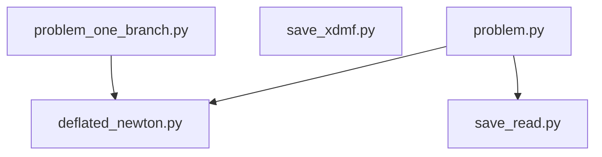

# Deflation techniques - compression of a hyperelastic beam

This repository contains my own straighforward implementation of the deflation techniques in FEniCS (legacy FEniCS 2019) for finding multiple solutions to the problem of compression of a hyperelastic beam. For more details see [protocol](deflation.pdf).

- Scripts:

